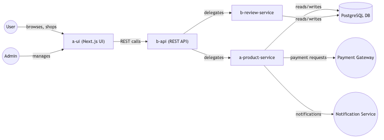
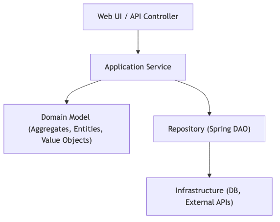
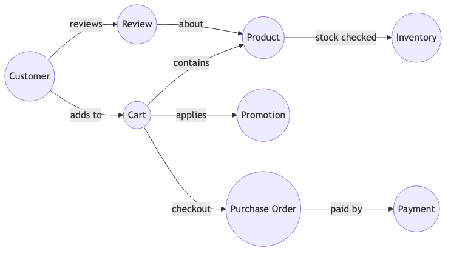
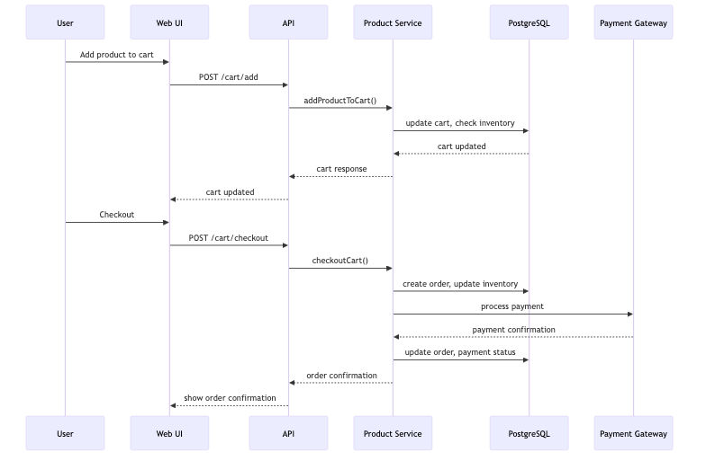
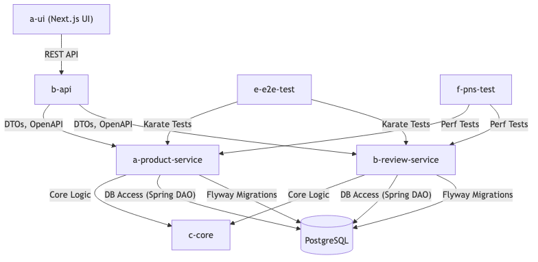
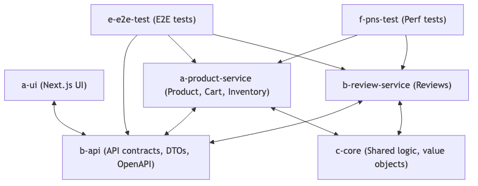

# The Hobbit Online Store

## High Level Description

The Hobbit Online Store is a scalable, modular e-commerce platform designed for modern web and enterprise environments. It provides robust shopping cart management, product catalog, inventory, customer management, order processing, promotions, and review features. The system is built using Java 24, Spring Boot, Gradle, PostgreSQL, Flyway, Karate, and follows Domain-Driven Design (DDD) principles. It supports API-first development, multi-tenancy, localization, and is optimized for performance, security, and maintainability.
- **Key Features:**
  - Shopping cart management (add, remove, update items, apply discounts)
  - Product, inventory, and review management
  - Customer, wishlist, and promotion support (TBD)
  - Order, payment, and order history tracking (TBD)
  - Multi-tenancy, multi-environment, and multi-device/browser support


## Module Overviews

- **a-ui**: Next.js web UI for customer-facing storefront and admin management. (TBD)
- **b-api**: Java API module defining RESTful endpoints, DTOs, and OpenAPI/Swagger documentation.
- **c-core**: Pure Java core utilities and shared logic, no I/O dependencies.
- **d-services**:
  - **a-product-service**: Implements product, cart, and inventory business logic and REST controllers.
  - **b-review-service**: Handles product reviews, ratings, and review-related business logic.
  - **b-review-service**: Handles product reviews, ratings, and review-related business logic. (TBD)
- **e-e2e-test**: Karate-based end-to-end API and UI test suite. (TBD)
- **f-pns-test**: Karate-based performance and sizing test suite. (TBD)

Each module is designed for separation of concerns, testability, and clean architecture, enabling rapid development and easy onboarding for new team members.

## Architecture and Design Principles
- **Microservices Architecture:** Each module is a self-contained microservice, allowing independent development, deployment, and scaling.
- **API-First Development:** The API module defines all endpoints and data transfer objects (DTOs) with OpenAPI/Swagger documentation for clarity and ease of use.
- **Modular Design:** The system is divided into distinct modules, each with a specific responsibility, promoting separation of concerns and maintainability.
- **Domain-Driven Design (DDD):** The system models aggregates, entities, and value objects according to DDD principles, ensuring a clear domain model and business logic encapsulation.
- **Test-Driven Development (TDD):** Each module includes unit, integration, and end-to-end tests to ensure code quality and reliability.
- **Modular Architecture:** The project is organized into multiple submodules, each responsible for a specific domain such as API, core logic, product service, review service, and UI.
- **Domain-Driven Design (DDD):** Aggregates, entities, and value objects are modeled according to DDD principles for maintainability and scalability.
- **Technology Stack:**
  - Java 24, Spring Boot, Lombok, MapStruct, Gradle
  - PostgreSQL with Flyway for migrations
  - Karate for API and end-to-end testing
  - OpenAPI/Swagger for API-first development and documentation
  - Next.js for the web UI
- **Best Practices:**
  - Clean architecture and code quality
  - Automated testing (unit, integration, e2e)
  - Security, authentication, and authorization
  - Performance optimization and resource efficiency
  - Version control and CI/CD ready

## System Context Diagram



**Explanation:**
- Users and admins interact via the web UI.
- The UI communicates with the API, which delegates to product and review services.
- Services access the PostgreSQL database and may call external systems (payment, notifications).

---

## Layered Architecture Diagram



**Explanation:**
- The UI/controller layer handles HTTP requests.
- Application services coordinate business logic.
- The domain layer encapsulates core business rules (DDD aggregates, entities, value objects).
- Repositories abstract data access.
- Infrastructure handles persistence and external integrations.

---

## DDD Aggregate Interaction Diagram



**Explanation:**
- Customers add products to carts, which reference inventory for stock.
- Promotions may be applied at checkout.
- Checkout creates a purchase order and payment.
- After purchase, customers can leave reviews for products.

---

## Example Request Flow: Product Purchase



**Explanation:**
- The user adds a product to their cart, which updates the cart and checks inventory.
- On checkout, the system creates an order, updates inventory, processes payment, and updates order/payment status.
- The user receives confirmation of their order.

---

## Module Interaction Diagram



---

## Codebase Structure Diagram



---

## Detailed Design and Architecture

### Domain-Driven Design (DDD) Overview
The Hobbit Online Store is structured around DDD principles, with each submodule representing a bounded context. Aggregates encapsulate business logic and enforce invariants. Value objects are used for all domain model properties (no primitives), ensuring immutability and validation.

- **Aggregates & Bounded Contexts:**
  | Aggregate         | Bounded Context (Module)      | Key Value Objects                |
  |-------------------|------------------------------|----------------------------------|
  | Cart              | a-product-service             | CartId, CartItemId, Money        |
  | Product           | a-product-service             | ProductId, Price, CategoryId     |
  | Inventory         | a-product-service             | InventoryId, Quantity            |
  | Customer          | (future)                      | CustomerId, Email, Address, Phone|
  | Review            | b-review-service              | ReviewId, Rating                 |
  | Order             | (future)                      | OrderId, PaymentId, Status       |
  | Promotion         | a-product-service             | PromotionId, Discount            |
  | Wishlist          | (future)                      | WishlistId                       |

- **Multi-Tenancy & Environment:**
  - All tables (except `environment` and `tenant`) include `environment_id` (env_id domain) and `tenant_id` (ulid domain) columns.
  - Compound primary keys: (id, environment_id, tenant_id).
  - Supports multiple environments (dev, test, prod) and tenants (for SaaS/multi-customer scenarios).

- **Immutability & Value Objects:**
  - All domain model fields use value objects (e.g., Email, Money, ULID) for type safety and validation.
  - No Java primitives in domain models.

### Detailed Codebase Design

The Hobbit Online Store is organized into modular subprojects, each with a clear responsibility and DDD-aligned boundaries. This structure enables separation of concerns, scalability, and ease of maintenance.

#### Module Structure

- **a-ui**: Next.js web UI for customers and admins.
- **b-api**: Defines RESTful API contracts, DTOs, and OpenAPI/Swagger docs. No business logic.
- **c-core**: Pure Java utilities, value objects, and shared logic. No I/O dependencies.
- **d-services**:
  - **a-product-service**: Implements product, cart, inventory, and related business logic. Contains DDD aggregates, entities, value objects, repositories, and REST controllers.
  - **b-review-service**: Handles product reviews and ratings, with its own DDD aggregates and logic.
- **e-e2e-test**: Karate-based end-to-end API and UI tests.
- **f-pns-test**: Karate-based performance and sizing tests.

### DDD Aggregate Mapping

- **Product Aggregate**: Product, Category, Inventory, ProductImage
- **Cart Aggregate**: Cart, CartItem
- **Customer Aggregate**: Customer, Wishlist, WishlistItem
- **Order Aggregate**: PurchaseOrder, Payment, OrderHistory
- **Promotion Aggregate**: Promotion
- **Review Aggregate**: Review
- **Tenant/Environment**: Multi-tenancy and environment support via shared columns and compound PKs

Value objects include: Address, Email, PhoneNumber, Money, Rating, etc.

## Database Schema Design

The schema is designed for multi-tenancy, multi-environment, and DDD aggregate boundaries. All tables (except environment and tenant) include `env_id` and `tenant_id` columns, and use compound primary keys for data isolation.

### Key Tables
- **Environment**: `environment` (env_id, name)
- **Tenant**: `tenant` (tenant_id, name)
- **Product**: `product` (product_id, name, description, price, category_id, env_id, tenant_id)
- **Category**: `category` (category_id, name, env_id, tenant_id)
- **Inventory**: `inventory` (inventory_id, product_id, quantity, env_id, tenant_id)
- **Cart**: `cart` (cart_id, customer_id, env_id, tenant_id)
- **CartItem**: `cart_item` (cart_item_id, cart_id, product_id, quantity, env_id, tenant_id)
- **Customer**: `customer` (customer_id, email, address, phone, env_id, tenant_id)
- **Wishlist**: `wishlist` (wishlist_id, customer_id, env_id, tenant_id)
- **WishlistItem**: `wishlist_item` (wishlist_item_id, wishlist_id, product_id, env_id, tenant_id)
- **PurchaseOrder**: `purchase_order` (order_id, customer_id, status, total_amount, env_id, tenant_id)
- **Payment**: `payment` (payment_id, order_id, amount, status, env_id, tenant_id)
- **OrderHistory**: `order_history` (history_id, order_id, status, timestamp, env_id, tenant_id)
- **Promotion**: `promotion` (promotion_id, code, discount, env_id, tenant_id)
- **Review**: `review` (review_id, product_id, customer_id, rating, comment, env_id, tenant_id)
- **ReviewImage**: `review_image` (image_id, review_id, image_url, env_id, tenant_id)
- **ReviewLike**: `review_like` (like_id, review_id, customer_id, env_id, tenant_id)

## DDD Aggregate Boundaries in Schema

- **Cart Aggregate**: `cart`, `cart_item` (root: cart)
- **Product Aggregate**: `product`, `category`, `product_image`, `inventory` (root: product)
- **Customer Aggregate**: `customer`, `wishlist`, `wishlist_item` (root: customer)
- **Order Aggregate**: `purchase_order`, `payment`, `order_history` (root: purchase_order)
- **Promotion Aggregate**: `promotion`
- **Review Aggregate**: `review`

---

## Build and Run Instructions

### Prerequisites
- Java 24 (ensure `JAVA_HOME` is set)
- Node.js (for a-ui Next.js frontend)
- PostgreSQL (running and accessible)
- Gradle (or use the provided `./gradlew` wrapper)

### Build All Modules
```sh
./gradlew clean build
```

### Run Backend Services
- To run the product service:
```sh
./gradlew :d-services:a-product-service:bootRun
```
- To run the review service:
```sh
./gradlew :d-services:b-review-service:bootRun
```

### Run the Web UI
```sh
cd a-ui
npm install
npm run dev
```

### Database Setup
- Ensure PostgreSQL is running and the connection details match those in `application.properties`.
- Flyway migrations will run automatically on service startup.

### Run Tests
- Unit/Integration tests:
```sh
./gradlew test
```
- End-to-end tests (Karate):
```sh
./gradlew :e-e2e-test:test
```
- Performance tests (Karate):
```sh
./gradlew :f-pns-test:test
```

---

## Design Rationale and Best Practices

- **Separation of Concerns:** Each module and layer has a clear responsibility, making the system easier to maintain and extend.
- **Domain-Driven Design:** Aggregates and value objects encapsulate business rules, ensuring consistency and type safety.
- **API-First:** All endpoints are defined in the API module with OpenAPI/Swagger, enabling contract-driven development and easy integration.
- **Testability:** The modular structure and DDD boundaries make it easy to write unit, integration, and end-to-end tests.
- **Multi-Tenancy & Environment:** Compound primary keys and shared columns ensure data isolation for different tenants and environments.
- **Extensibility:** New features (e.g., new aggregates, external integrations) can be added with minimal impact on existing code.
- **Security:** Authentication, authorization, and validation are enforced at the API and service layers.
- **Performance:** Optimized queries, indexing, and stateless services ensure scalability and responsiveness.

---
